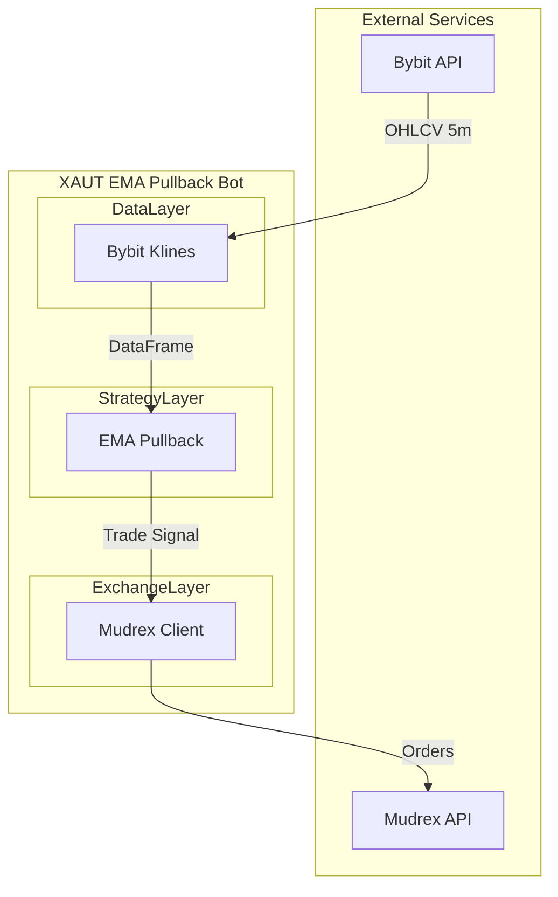
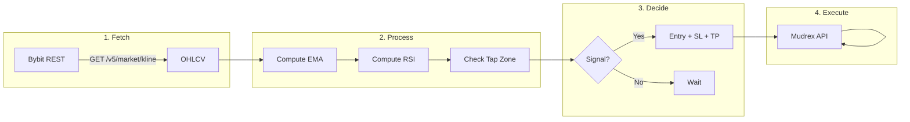
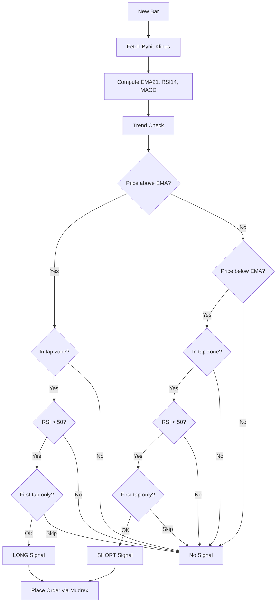
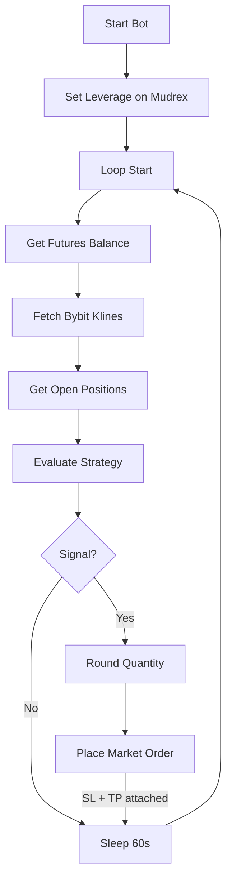
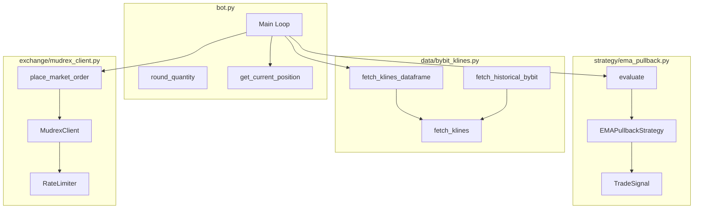

# XAUT EMA Pullback Strategy

Production-ready EMA Pullback strategy for **XAUTUSDT** futures. Deployable to Railway.

- **Execution**: [Mudrex Futures API](https://docs.trade.mudrex.com/docs/overview) (where trades are placed)
- **Prices**: Bybit klines (Mudrex uses Bybit as broker, so we follow Bybit prices)

---

## Strategy Description

Trades pullbacks to the 21 EMA in trending gold-backed token markets. Catches momentum continuation moves after brief retracements.

On the 5-minute chart, we use a 21-period EMA as the trend reference. When price is in an uptrend (above EMA) and pulls back into a narrow "tap zone" (0.2% above the EMA), we go long. The opposite applies for shorts when price is below the EMA. RSI filters confirm momentum (RSI > 50 for longs, RSI < 50 for shorts). Stop loss is placed 0.5% beyond the EMA; take profit targets 2× the risk. Position size risks 1% of equity per trade.

---

## System Architecture



---

## Data Flow



---

## Strategy Logic Flow



---

## Bot Main Loop



---

## Component Architecture



---

## File Structure

```
XAUT-EMA-Pullback-Strategy/
├── bot.py                 # Main trading loop (production)
├── backtest.py            # Backtest on Bybit historical data
├── config.py              # Strategy + Mudrex configuration
├── requirements.txt
├── .env.example           # MUDREX_API_SECRET
│
├── strategy/
│   └── ema_pullback.py    # EMA pullback logic, RSI filter
│
├── data/
│   └── bybit_klines.py    # Bybit kline fetcher (REST)
│
├── exchange/
│   └── mudrex_client.py   # Mudrex API client (rate-limited)
│
├── Dockerfile             # Railway deployment
├── Procfile
├── railway.toml
└── .dockerignore
```

---

## Strategy Parameters

| Parameter | Default | Description |
|-----------|---------|-------------|
| `ema_period` | 21 | EMA length for trend |
| `tap_threshold_pct` | 0.2 | Tap zone size (% around EMA) |
| `stop_loss_buffer_pct` | 0.5 | SL distance beyond EMA |
| `take_profit_rr` | 2.0 | Risk-reward ratio |
| `risk_per_trade_pct` | 1.0 | Risk per trade (%) |
| `use_rsi_filter` | true | RSI > 50 long, RSI < 50 short |
| `first_tap_only` | true | Only first pullback after trend flip |

### Low-Balance Support (autoscale leverage)

| Parameter | Default | Description |
|-----------|---------|-------------|
| `auto_leverage` | true | Scale leverage from balance to meet min order |
| `min_order_value` | 5.0 | Minimum notional ($) per trade |
| `max_leverage` | 50 | Cap leverage |

With `auto_leverage`, the bot computes leverage so that margin stays within balance and notional meets `min_order_value`. Supports balances of $5 or less.

---

## Setup

```bash
git clone https://github.com/DecentralizedJM/XAUT-EMA-Pullback-Strategy.git
cd XAUT-EMA-Pullback-Strategy
pip install -r requirements.txt
cp .env.example .env
# Edit .env and add MUDREX_API_SECRET
```

---

## Usage

```bash
# Backtest (Bybit data, no API keys)
python backtest.py --days 365

# Paper trading (no real orders)
python bot.py --paper

# Live trading (Mudrex)
python bot.py
```

---

## Deploy to Railway

1. Push to GitHub: [DecentralizedJM/XAUT-EMA-Pullback-Strategy](https://github.com/DecentralizedJM/XAUT-EMA-Pullback-Strategy)
2. Create a Railway project → Deploy from GitHub
3. Add `MUDREX_API_SECRET` in Railway dashboard
4. Deploy – Railway runs `python bot.py` 24/7

---

## API References

- [Mudrex Futures API](https://docs.trade.mudrex.com/docs/overview)
- [Bybit Kline API](https://bybit-exchange.github.io/docs/v5/market/kline)

---

## Disclaimer

Trading futures involves risk. Backtest and paper trade before using real capital.
